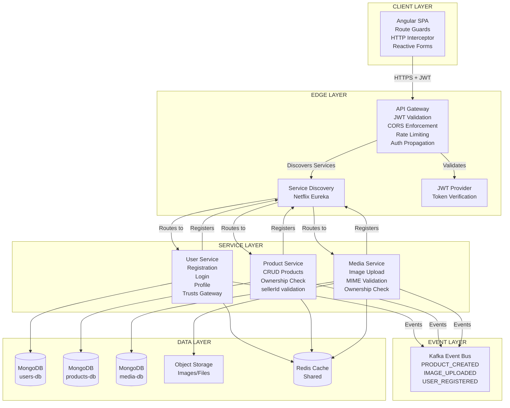

# Buy-01 E-Commerce System Architecture

## Microservices Architecture with Centralized Authentication

## Authentication Flow

1. **User Login** → User Service
2. **JWT Returned** → Angular stores token
3. **Request with Token** → API Gateway
4. **Gateway Validates JWT** → Extracts userId & role
5. **Headers Forwarded** → X-User-Id, X-Role to services
6. **Services Enforce Ownership** → sellerId == X-User-Id

**JWT Contains:**
- `sub` (userId)
- `role` (SELLER/CLIENT)
- `exp` (expiration)

## Architecture Characteristics

 **Centralized Authentication** - JWT validation at Gateway only  
 **Decoupled Services** - No direct service-to-service calls  
 **Independent Databases** - Zero shared database  
 **Shared Redis Cache** - Product catalog, sessions, rate limiting  
 **Gateway as Single Entry Point** - Client never talks to services directly  
 **Event-Driven Capability** - Kafka for async communication  
 **Stateless Services** - Horizontal scaling ready  
 **Production-Ready Layering** - Clear separation of concerns
